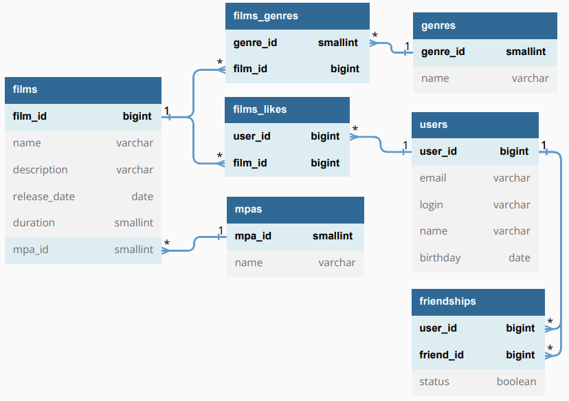

# java-filmorate
Репозиторий для проекта Filmorate.

## Sql-диаграмма и пояснения к ней


### ***films***
Содержит данные о фильме.
Таблица включает такие поля:
* первичный ключ _film_id_ — идентификатор фильма;
* _name_ — название фильма;
* _description_ — описание фильма;
* _release_date_ — дата релиза;
* _duration_ — длительность (в минутах);
* _mpa_id_ — идентификатор рейтинга.

### ***films_likes***
Содержит данные о лайках, поставленных фильму.
Таблица включает такие поля:
* первичный ключ _user_id_ — идентификатор пользователя, поставившего лайк;
* внешний ключ _film_id_ — идентификатор фильма.

### ***genres***
Содержит информацию о жанрах кино.
В таблицу входят поля:
* первичный ключ _genre_id_ — идентификатор жанра;
* _name_ — название жанра.

### ***films_genres***
Содержит данные о жанрах, указанных фильму.
Таблица включает такие поля:
* первичный ключ _genre_id_ — идентификатор лайка;
* внешний ключ _film_id_ — идентификатор фильма.

### ***mpas***
Содержит информацию о рейтинге Ассоциации кинокомпаний.
В таблицу входят поля:
* первичный ключ _mpa_id_ — идентификатор рейтинга;
* _name_ — название рейтинга.

### ***users***
Содержит данные о пользователе.
Таблица включает такие поля:
* первичный ключ _user_id_ — идентификатор пользователя;
* _email_ — электронная почта пользователя;
* _login_ — логин пользователя;
* _name_ — имя пользователя;
* _birthday_ — дата рождения.

### ***friendships***
Содержит информацию о дружбе между двумя пользователями.
В таблицу входят поля:
* первичный ключ _user_id_ — идентификатор пользователя;
* внешний ключ _friend_id_ — идентификатор друга пользователя;
* _status_ — статус (false — неподтвержденная дружба, true — подтвержденная).

#### Работа бизнес-логики, связанной с таблицей
Пользователь 1 добавляет пользователя 2 в друзья. 
Появляется запись в таблице вида {"user_id" = 1, "friend_id" = 2, "status" = false}.
У пользователя 2 в друзьях есть пользователь 1, но не наоборот.
Пользователю 2 нужно добавить в друзья пользователя 1,
тогда изначальная запись изменится и будет выглядеть след. образом: {"user_id" = 1, "friend_id" = 2, "status" = true}.
Новая запись при этом не создается. Теперь у пользователя 1 есть в друзьях пользователь 2.
#### Пример запроса
Пример запроса к таблице friendships (вывод всех друзей пользователя с id = 1)
```
SELECT friend_id 
FROM friendships 
WHERE user_id = 1 AND status = true
UNION 
SELECT user_id AS friend_id 
FROM friendships 
WHERE friend_id = 1
```
### Описание связей между таблицами
#### films.film_id < films_likes.film_id > users.user_id
Фильму могут поставить лайки несколько пользователей, один пользователь может поставить несколько лайков разным фильмам.
Реализация связи "многие ко многим" с помощью вспомогательной таблицы films_likes.
#### films.film_id < films_genres.film_id > genres.genre_id
Одному фильму соответствует несколько жанров, одному жанру могут соответствовать несколько фильмов.
Реализация связи "многие ко многим" с помощью вспомогательной таблицы films_genres.
#### mpas.film_id < films.film_id
Одному рейтингу могут принадлежать несколько фильмов, но у одного фильма не может быть несколько рейтингов.
#### users.user_id < friendships.user_id > users.user_id
У одного пользователя может быть несколько друзей, одна дружба может быть у нескольких пользователей.
Реализация связи "многие ко многим" с помощью вспомогательной таблицы friendships.